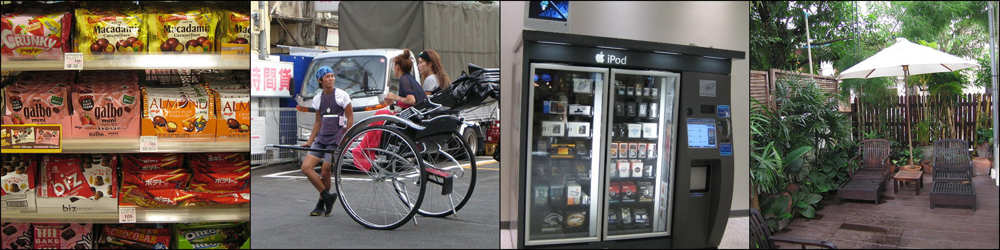
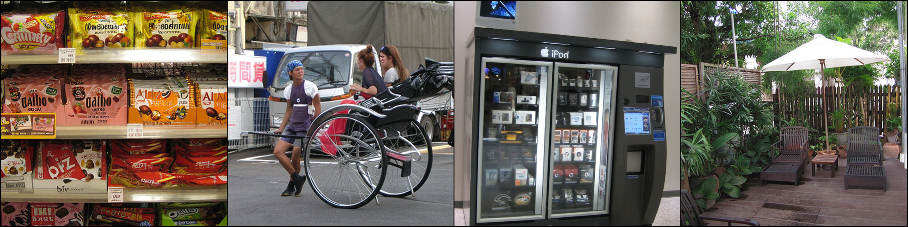
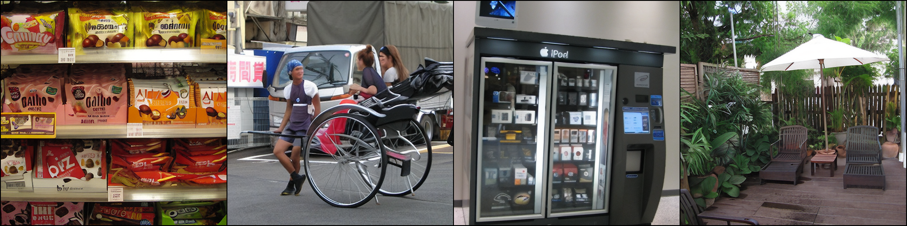
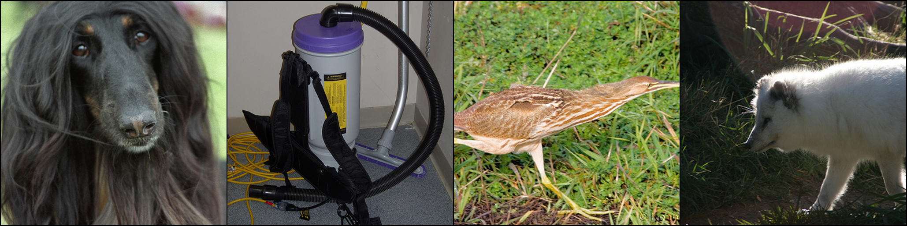
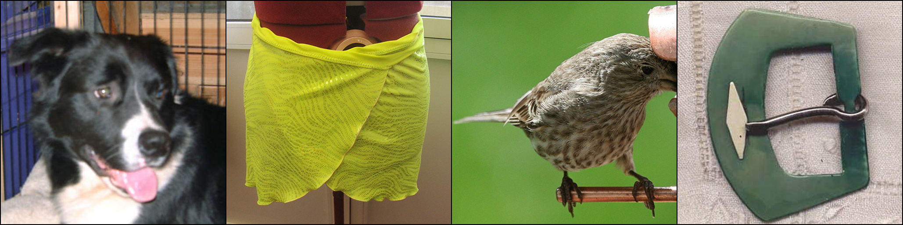
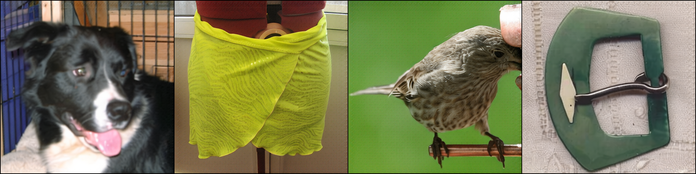

# Deep Conpression AutoDecoder via Distillation

Jingyuan Zhang tonyzhang666@sjtu.edu.cn

School of Electronic Information and Electrical Engineering

Shanghai Jiao Tong University

## Abstract

This project constructs a pipeline to get light models with minimal loss via distillation. First, we prune model structure of decoder and arquire light student models. Then, we do distillation training with teacher model [dc-ae-f32c32-in-1.0](https://huggingface.co/mit-han-lab/dc-ae-f32c32-in-1.0) to reduce the gap as much as possible. During traing, we always freeze the encoder part and project out part of decoder. Furthermore, we involved tricks like AdamW optimizer, CosineAnnealingWarmRestarts Scheduler, Dynamic Loss Weight Adjustment Method, Batch Accumulation and Segment Training. Components of loss function include L1 distillation loss, L1 image loss, LPIPS loss, PatchGAN loss etc. After that, we choose FID, PSNR, SSIM and LPIPS as our evaluation matrice for image quality and MACs/inference time as indicators for speed. Finally, new light models outperform benchmark in PSNR and SSIM, the quality of generated images. Also, there is no significant difference in visualization between the generated image and teacher model. **The main codes are in "DC_DE-via-Distillation/applications/dc_ae/scripts"**


## Environment Setup

1. In this folder, run the command below to create a new environment named "myenv", or it will create an environment named efficientvit by default.

``` bash
conda env create -f environment.yml -n myenv
```

2. Notice that the efficientvit package in path efficientvit/applications/dc_ae/scripts/efficientvit and efficientvit/efficientvit have been modified due to the changes in new model configurations.


## Usage


### Demo
The command of VAE model demonstration is in file "efficientvit/applications/dc_ae/scripts/demo_recons.sh", you may also use the command:

``` bash
CUDA_VISIBLE_DEVICES=1 python /data2/user/jyzhang/MIT/efficientvit/applications/dc_ae/scripts/demo-dc-ae-recons.py \
--pretrained_model /data2/user/jyzhang/MIT/efficientvit/applications/dc_ae/pruned_models/dc-ae-f32c32-in-1.0-w4-v4
```

The demo picture will be stored in path "efficientvit/applications/dc_ae/reconstruction_results".


### Modify Model Structure

Code for modifying layers and pruning components is in "dc_de_modify_layer.py", and run the command:

``` bash
CUDA_VISIBLE_DEVICES=3 python /data2/user/jyzhang/MIT/efficientvit/applications/dc_ae/scripts/dc_de_modify_layer.py \
--prune_method direct --prune_version w4-v3 \
--pretrained_model /data2/user/jyzhang/MIT/efficientvit/applications/dc_ae/pretrained_models/dc-ae-f32c32-in-1.0 \
--save_path /data2/user/jyzhang/MIT/efficientvit/applications/dc_ae/pruned_models/dc-ae-f32c32-in-1.0-w4-v3/model.safetensors
```

There are three pruning methods. "Direct" means if I want to take 15 out of 30 parameters, the first 15 parameters will be taken directly. "gap" method will take 15 at intervals and "random" method will initialize to normally distributed random numbers.

Parameter pretrained_model are path for pretrained teacher model and save_path are for target model. In model save path, there're two other files, config.json for model_name which has been registered in ae_model_zoo.py and dc_ae.py and training_loss.txt for records during training.

Remember changing file/model path to the local path on your device. If you want to create new models by modifying layers, remember adding corresponding model info in "efficient/model/efficient/dc_ae.py and efficient/ae_model_zoo.py".


### Model List

We have several versions of pruned models list below and you may download them from Google Drive links.


| Model Name                                                                         | Description                                | Training Dataset      | Note   |
| :---------------------------------------------------------------------------------: | :-----------------------------------------: | :-------------------: | :----: |
| [dc-ae-f32c32-in-1.0-w3-v2](https://huggingface.co/tonyzhang666/dc-ae-f32c32-in-1.0-w3-v2)       | Base Model, decoder.depth_list=[0,5,10,2,2,2] -> [0,5,10,1,1,2], Decoder Compression Ratio 10%, MACs reduce 1.5%   | ImageNet              | |
| [dc-ae-f32c32-in-1.0-w4-v1](https://huggingface.co/tonyzhang666/dc-ae-f32c32-in-1.0-w4-v1)       | Base Model, decoder.depth_list=[0,5,10,2,2,2] -> [0,3,5,2,2,2], Compression Ratio 8%, 22% reduction in total MACs and 40% reduction in decoder MACs    | ImageNet              | |
| [dc-ae-f32c32-in-1.0-w4-v2](https://huggingface.co/tonyzhang666/dc-ae-f32c32-in-1.0-w4-v2)     | Base Model, decoder.depth_list=[0,5,10,2,2,2] -> [0,3,5,1,1,2], Compression Ratio 14%, 24% reduction in total MACs and 42% reduction in decoder MACs   | ImageNet              | |
| [dc-ae-f32c32-in-1.0-w4-v3](https://huggingface.co/tonyzhang666/dc-ae-f32c32-in-1.0-w4-v3)   | Base Model, decoder.depth_list=[0,5,10,2,2,2] -> [0,1,2,1,1,2], Compression Ratio 12%, 40% reduction in total MACs, 65% reduction in decoder MACs | ImageNet              | |
| [dc-ae-f32c32-in-1.0-w4-v4](https://huggingface.co/tonyzhang666/dc-ae-f32c32-in-1.0-w4-v4)     | Based on dc-ae-f32c32-in-1.0-w3-v2, distillation training with GAN, Loss = 100 * L1_Dis + 1 * L1 + 0.1 * LPIPS + 0.05 * PatchGAN, GAN training ratio 300:1    | ImageNet | |
| [dc-ae-f32c32-in-1.0-w4-v8](https://huggingface.co/tonyzhang666/dc-ae-f32c32-in-1.0-w4-v8)   | Based on dc-ae-f32c32-in-1.0-w4-v1, distillation training with GAN, Loss = 100 * L1_Dis + 1 * L1 + 0.1 * LPIPS + 0.1 * PatchGAN, GAN training ratio 300:1   | ImageNet | |
| [dc-ae-f32c32-in-1.0-w4-v25](https://huggingface.co/tonyzhang666/dc-ae-f32c32-in-1.0-w4-v25) | Based on dc-ae-f32c32-in-1.0-w4-v3, distillation training with GAN, Loss = 100 * L1_Dis + 1 * L1 + 0.1 * LPIPS + 0.3 * PatchGAN, GAN training ratio 300:1, Dynamic Loss Training | ImageNet | |


### Distillation Training and Evaluation

Normally, for all the training, we set 15 epochs and use 600 pictures randomly chosen from ImageNet for each epoch, costing about 75 mins on a single A6000 GPU. During all the training, we fix the encoder and project out layer of decoder.

There're two versions of pipeline, with GAN Loss and without GAN Loss but the main ideas of them are similar. For distillation part, there're three choices, before project_out layer, after TritonRMSNorm2d and after ReLU activation function. From ablation study, we choose to align the matrix after ReLU activation function using L1 Loss.

For the image generation loss part, we combine L1 loss, LPIPS loss and PatchGAN loss together with different weights.

For training techniques, we tried adding AdamW optimizer, CosineAnnealingWarmRestarts Scheduler, Dynamic Loss Weight Adjustment Method, Batch Accumulation and Segment Training, but only some of them seems to work. After that, we chose to use  AdamW optimizer, CosineAnnealingWarmRestarts Scheduler and Dynamic Loss Weight Adjustment Method.

During experiments of parameter tuning, we found that distillation loss has much more importance than image generation loss. Even if the image evaluation matrices have reach a satisfactory result, the pictures are still not good enough due to high diatillation loss. Therefore, we give distillation loss a much higher weight during the first 10 epoch and let it gradually decrease to half of its original value according to the cosine law. The idea is to ensure the accuracy of distillation first! During the last 5 epoch, we focus more on image loss, and gradually increase their weights to double of their original value according to the cosine law.

For example, to train a student model based on w4-v3 pruned model, Loss = 100 * L1_Distillation + 1 * L1_Image + 0.1 * LPIPS_Image + 0.3 * PatchGAN_Image. And the training proportion of generation model(student model) and discrimination model is 300, which means we train student model for 300 samples and then train GAN discriminator model once, in case the discriminator learns too fast so that the student model will get lost and don't know how to optimize toward arquiring real images. The training command are as followed (the complete training command for three best models are in file train_distillation.sh):

``` bash
# Training Code for dc-ae-f32c32-in-1.0-w4-v25
# Expected FID: 2.22879, PSNR: 26.22011, SSIM: 0.72431, LPIPS: 0.12579
# Based on model w4-v3, decoder.depth_list=[0,5,10,2,2,2] -> [0,1,2,1,1,2], 
# Compression Ratio 12%, 40% reduction in total MACs, 65% reduction in decoder MACs
CUDA_VISIBLE_DEVICES=7 python /data2/user/jyzhang/MIT/efficientvit/applications/dc_ae/scripts/dc_de_distillation_gan.py \
--batch_size 4 --learning_rate_G 1e-4 --learning_rate_D 1e-4 --num_epochs 15 --train_samples 600 \
--student_model_path /data2/user/jyzhang/MIT/efficientvit/applications/dc_ae/pruned_models/dc-ae-f32c32-in-1.0-w4-v3 \
--model_save_dir /data2/user/jyzhang/MIT/efficientvit/applications/dc_ae/pruned_models/dc-ae-f32c32-in-1.0-w4-v25 \
--pic_save_dir /data2/user/jyzhang/MIT/efficientvit/applications/dc_ae/pruned_models/pic_results_w4_v25 \
--alpha_disti 100 --alpha_img 1 --beta 0.1 --gamma 0.3 --gan_ratio 300 --align 3 --freeze_proj_out True --freeze_encoder True \
--cosine_T_0_G 5 --cosine_T_mult_G 1 --eta_min_G 1e-6 --weight_decay_G 0.01 \
--cosine_T_0_D 5 --cosine_T_mult_D 1 --eta_min_D 1e-6 --weight_decay_D 0.01 \
--dynamic_loss True --division_epoch 10 \
--accumulate_batch False --accumulation_steps 4 \
--shallow_train False --shallow_training_epochs 5 --model_config dc-ae-f32c32-in-1.0-pruned-w4-v3
```

You can measure the evaluation matrice (FID, PSNR, SSIM, LPIPS) of models through the command below, be aware to substitute the args "model" with your target model path.

``` bash
CUDA_VISIBLE_DEVICES=7 torchrun --nnodes=1 --nproc_per_node=1 --master_port 29505 -m applications.dc_ae.eval_dc_ae_model dataset=imagenet_512 model=/data2/user/jyzhang/MIT/efficientvit/applications/dc_ae/pruned_models/dc-ae-f32c32-in-1.0-w4-v25 run_dir=tmp
```
During training, the generation pictures (ground truth, teacher model, student model) at the end of each epoch will be stored in "pic_save_dir" and the loss information will be save to "model_save_dir/training_losses.txt". So, we can better monitor the training process and analysis the problems.

Batch accumulation method use "accumulation_step" parameter to update parameter after certain batches to virtually increase batch size.

In Segement train method, we intend to train shallow layers/blocks first and deep ones later to resuce the training cost and improve efficiency. Unfortunately, these attempts seem to fail.

For exact and detailed meaning, type, default value etc. of each parameter, please refer to code or Appendix. If you are interested in more detailed training and debugging process, you may also refer to [this Feishu Docs](https://sjtu.feishu.cn/docx/TaexdtRxfoLwsoxbrQQcS9nynRe).


## Demo of DC_DE

- Demo of training results

| Model                                                                         | Description                                | Result      | Epoch 15  |
| :---------------------------------------------------------------------------------: | :-----------------------------------------: | :-------------------: | :---------------: |
| [dc-ae-f32c32-in-1.0-w4-v4](https://huggingface.co/mit-han-lab/dc-ae-f32c32-in-1.0)       | **Based on dc-ae-f32c32-in-1.0-w3-v2**, distillation training with GAN, Loss = 100 * L1_Dis + 1 * L1 + 0.1 * LPIPS + 0.05 * PatchGAN, GAN training ratio 300:1, Compression Ratio 10%, 1.5% reduction in total MACs   | Ground Truth              |  |
|     |            | Teacher Model|  |
|   |             | Ours|  |
| [dc-ae-f32c32-in-1.0-w4-v8](https://huggingface.co/mit-han-lab/dc-ae-f32c32-mix-1.0)     |  **Based on dc-ae-f32c32-in-1.0-w4-v1**, distillation training with GAN, Loss = 100 * L1_Dis + 1 * L1 + 0.1 * LPIPS + 0.1 * PatchGAN, GAN training ratio 300:1, Compression Ratio 8%, 22% reduction in total MACs and 40% reduction in decoder MACs    | Ground Truth |  |
|    |  | Teacher Model |  |
| | | Ours |  |
| [dc-ae-f32c32-in-1.0-w4-v25](https://huggingface.co/mit-han-lab/dc-ae-f32c32-sana-1.0)   | **Based on dc-ae-f32c32-in-1.0-w4-v3**, distillation training with GAN, Loss = 100 * L1_Dis + 1 * L1 + 0.1 * LPIPS + 0.3 * PatchGAN, GAN training ratio 300:1, Dynamic Loss Training, Compression Ratio 12%, 40% reduction in total MACs, 65% reduction in decoder MACs   | Ground Truth |  |
|  |    |Teacher Model|  |
|  |   | Ours |  |


- Demo of Picture Girls via Different Models

| Ground Truth  | Teacher Model                                | dc-ae-f32c32-in-1.0-w4-v4      | dc-ae-f32c32-in-1.0-w4-v8 | dc-ae-f32c32-in-1.0-w4-v25 |
| :-------------------: | :-------------------: | :-------------------: | :-------------------: | :-------------------: |
|       |  |          |  |  |


- Evaluation Matrices of Models
  
| Model Name                                                                        | FID(↓)                               | PSNR(↑)       | SSIM(↑)  | LPIPS(↓)  |
| :---------------: | :-------------------: | :-------------------: | :---------------: | :---------------: |
|   dc-ae-f32c32-in-1.0(benchmark)    | 0.2047 |    26.2547  | 0.7136| 0.0783 |
|   dc-ae-f32c32-in-1.0-w4-v4    | 0.83769 |    26.5646  | 0.73160| 0.09752 |
|   dc-ae-f32c32-in-1.0-w4-v8    | 1.69890 |    26.55881  | 0.73866| 0.11312 |
|   dc-ae-f32c32-in-1.0-w4-v25    | 2.22879 |   26.22011  | 0.72431| 0.12579 |


## Appendix

Generally the parameters and corresponding description are as followed:

``` bash
parser.add_argument("--teacher_model_path", type=str, default="/data2/user/jyzhang/MIT/efficientvit/applications/dc_ae/pretrained_models/dc-ae-f32c32-in-1.0", required=False, help="Path to the teacher model.")
parser.add_argument("--student_model_path", type=str, default="/data2/user/jyzhang/MIT/efficientvit/applications/dc_ae/pruned_models/dc-ae-f32c32-in-1.0-v1" ,required=False, help="Path to the student model.")
parser.add_argument("--model_config", type=str, default="dc-ae-f32c32-in-1.0-pruned-w4-v3" ,required=True, help="Config name of the model.")
parser.add_argument("--dataset_path", type=str, default="/home/jyzhang/dataset/imagenet/train", required=False, help="Path to the dataset (e.g., ImageNet).")
parser.add_argument("--batch_size", type=int, default=16, help="Batch size for training.")
parser.add_argument("--learning_rate_G", type=float, default=1e-4, help="Learning rate for training Generator (student model).")
parser.add_argument("--learning_rate_D", type=float, default=1e-4, help="Learning rate for training Discriminator.")
parser.add_argument("--alpha_disti", type=float, default=1.0, help="Weight for L1 Loss.")
parser.add_argument("--alpha_img", type=float, default=0.8, help="Weight for L1 Loss.")
parser.add_argument("--beta", type=float, default=0.1, help="Weight for LPIPS Loss.")
parser.add_argument("--gamma", type=float, default=0.05, help="Weight for PatchGAN Loss.")
parser.add_argument("--num_epochs", type=int, default=10, help="Number of epochs for training.")
parser.add_argument("--shallow_train", type=bool, default=False, required=False, help="Whether to train shallow layers first and full layers later.")
parser.add_argument("--shallow_training_epochs", type=int, default=5, help="Number of epochs for shallow layers training.")

parser.add_argument("--gan_ratio", type=int, default=10000, help="Number of epochs for training.")
parser.add_argument("--align", type=int, default=0, required=False, help="Latent to align with, 0 for final feature after project_out, 1 for feature before project_out, 2 for feature after Norm, 3 for feature after ReLu.")
parser.add_argument("--train_samples", type=int, default=1281167, help="Number of image samples for training. 1281167 is the whole num of samples in imagenet")
parser.add_argument("--pic_save_dir", type=str, default="/data2/user/jyzhang/MIT/efficientvit/applications/dc_ae/reconstruction_results", required=False, help="Path to the save sampled image.")
parser.add_argument("--model_save_dir", type=str, default="/data2/user/jyzhang/MIT/efficientvit/applications/dc_ae/pruned_models", required=False, help="Path to the save distillated model.")
parser.add_argument("--freeze_proj_out", type=bool, default=True, required=False, help="Whether to freeze the proj_out layer during training. It should be freezed for distillation training.")
parser.add_argument("--freeze_encoder", type=bool, default=True, required=False, help="Whether to freeze the encoder layer during training. It should be freezed for distillation training.")
parser.add_argument("--weight_decay_G", type=float, default=0.01, help="Weight decay for Generater AdamW optimizer.")
parser.add_argument("--weight_decay_D", type=float, default=0.01, help="Weight decay for Discriminator AdamW optimizer.")
parser.add_argument("--cosine_T_0_G", type=int, default=10, help="Number of iterations for the first restart for Generator.")
parser.add_argument("--cosine_T_0_D", type=int, default=10, help="Number of iterations for the first restart for Discriminator.")
parser.add_argument("--cosine_T_mult_G", type=int, default=1, help="A factor to increase T_i after each restart for Generator.")
parser.add_argument("--cosine_T_mult_D", type=int, default=1, help="A factor to increase T_i after each restart for Discriminator.")
parser.add_argument("--eta_min_G", type=float, default=1e-6, help="Minimum learning rate for Generator.")
parser.add_argument("--eta_min_D", type=float, default=1e-6, help="Minimum learning rate for Discriminator.")

parser.add_argument("--dynamic_loss", type=bool, default=False, required=False, help="Whether to use dynamic loss adatation strategy.")
parser.add_argument("--division_epoch", type=int, default=10, required=False, help="Before division epoch, focus more on distillation loss, After that, focus more on image results.")

parser.add_argument("--accumulate_batch", type=bool, default=False, required=False, help="Whether to batch accumulation training strategy.")
parser.add_argument("--accumulation_steps", type=int, default=4, required=False, help="For how much batches, update optimizer once.")
```

